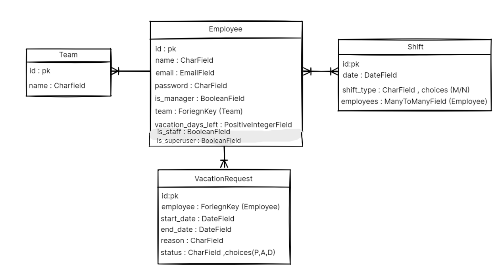

# Project Description
This is the frontend for Wassel (means "connector" in english) , a platform that connects a manager to his/her employees .it makes the decision making process easier and simplifies organizing employees , teams , shifts ,and requests. also it allows employee to view upcoming shifts as well as tracking vacation requests , update or cancel them , and make new ones. 

## Repository Description
this repo contains the backend code of Wassel .backend is responsible for manging and storing data for teams , employees , shifts , and vacation requests , it also handels authentication using jwt 

## Tech Stack
- Django

- Django REST Framework

- JWT 

- PostgreSQL

- Python

- Postman 
 
## Front End Repo Link
https://github.com/wareefAlolayan/wassel-frontend

## ERD

## Routing table 
| **Method** | **URL** | **Handler**| **Action**|
| ---------- | ---------------------------------------------------- | ------------------------------- | ---------------------------------------------------- |
| **GET** | `/teams/`| `TeamsIndex`| List all teams|
| **POST** | `/teams/` | `TeamsIndex` | Create a new team |
| **GET** | `/teams/<int:team_id>/` | `TeamDetail` `| Get details of a specific team|
| **PATCH** | `/teams/<int:team_id>/` | `TeamDetail` | Update details of a specific team |
| **DELETE** | `/teams/<int:team_id>/` | `TeamDetail` | Delete a specific team |
| **GET** | `/employees/` | `EmployeesIndex` | List all employees  |
| **GET** | `/employees/<int:emp_id>/` | `EmployeeDetail` | Get details of a specific employee |
| **GET** | `/shifts/` | `ShiftIndex` | List all shifts |
| **GET** | `/shifts/<int:shift_id>/` | `ShiftDetail` | Get details of a specific shift |
| **PATCH** | `/shifts/<int:shift_id>/assign/<int:employee_id>/` | `AssignEmployee` | Assign an employee to a shift |
| **PATCH** | `/shifts/<int:shift_id>/unassign/<int:employee_id>/` | `UnassignEmployee` | Unassign an employee from a shift |
| **GET** | `/vrequests/` | `VacationRequestsIndex` | List all vacation requests |
| **POST** | `/vrequests/employee/<int:emp_id>/` | `EmployeeVacationRequestCreate` | Create a vacation request for an employee  |
| **GET** | `/vrequests/<int:vacationRequest_id>/` | `VacationRequestDetail` | Get details of a specific vacation request |
| **PATCH** | `/vrequests/<int:vacationRequest_id>/` | `VacationRequestDetail` | Update a vacation request |
| **DELETE** | `/vrequests/<int:vacationRequest_id>/` | `VacationRequestDetail` | Delete a vacation request |
| **PATCH** | `/vrequests/<int:vacationRequest_id>/deny/` | `DenyVacationRequest` | Deny a vacation request |
| **PATCH** | `/vrequests/<int:vacationRequest_id>/accept/` | `AcceptVacationRequest` | Accept a vacation request and update employee status |
| **POST** | `/login/` | `TokenObtainPairView` | Obtain JWT token |
| **POST** | `/token/refresh/` | `TokenRefreshView` | Refresh JWT token |
 

## IceBox Features
- add shift change requests
- add password reset option
- search and filter employees and shifts 